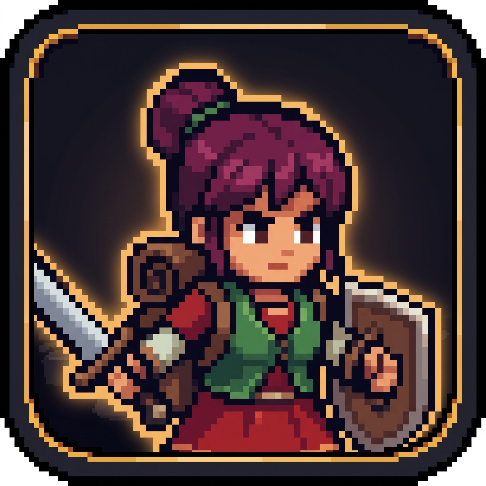
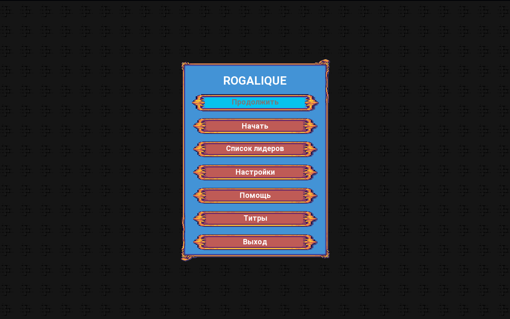
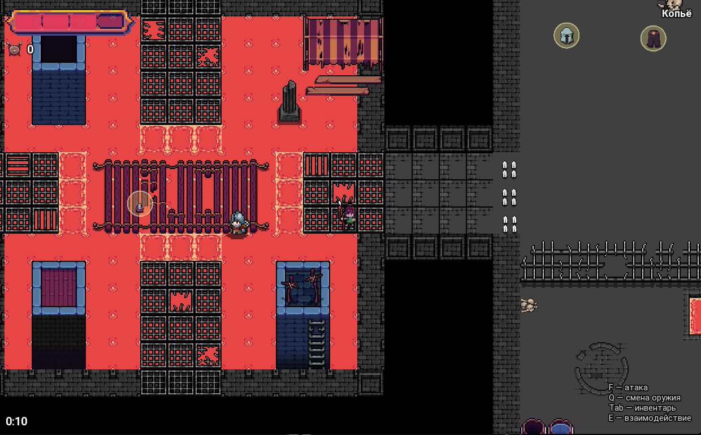

  

<h1 align="center">Rogalique</h1>

  Учебный 2D top-down экшен-рогалик на C++/SFML с собственным движком.

  
  

## О проекте

Игрок исследует процедурно собранное подземелье, зачищает его от орков, солдат и слизей, собирает снаряжение и ключи, а затем открывает главную дверь на арену — там нужно пережить волны врагов, чтобы победить. Есть сохранение/загрузка в любой момент (в том числе прямо посреди боя на арене), таблица рекордов по времени прохождения и настраиваемые графика/звук.

Игра целиком написана на C++ поверх [SFML](https://www.sfml-dev.org/) 2.5.1: игровая логика (`Rogalique/`) опирается на собственный лёгкий движок (`Engine/`), собранный отдельной DLL.

## Особенности

- **Процедурная генерация уровня** — подземелье каждый раз собирается заново из вручную нарисованных в [Tiled](https://www.mapeditor.org/) комнат-чанков, случайно сцепленных вокруг неизменного хаба; арена волн — тоже отдельная Tiled-карта, а не код (подробности — в [документации](docs/DOCUMENTATION.md#5-алгоритмы-и-важные-технические-решения)).
- **Полноценное сохранение** — позиция, HP, инвентарь, подобранные предметы и даже текущая волна боя на арене восстанавливаются один в один.
- **Три вида противников** — орк (ближний бой), солдат (меч + лук), три варианта слизи (в том числе делящаяся и стреляющая), у каждого патруль/погоня/тревога с конусом зрения.
- **Босс арены** — вампир с полным набором способностей: ближний и дальний бой, укус с лечением, разряд по площади с телеграфом, заряженный выстрел, залп из двух колец снарядов, телепорт на низком HP.
- **Инвентарь и экипировка** — 8 слотов снаряжения (оружие, броня, кольцо, ожерелье...), прочность брони считается отдельно от урона по HP.
- **Таблица лидеров** — время прохождения сохраняется и сортируется по возрастанию.
- **Настройки с реальным сохранением** — громкость, лимит FPS, разрешение и полноэкранный режим переживают перезапуск игры.

## Быстрый старт

Готовая сборка не нужна — движок и SFML уже лежат в репозитории.

1. Установите **Visual Studio 2022** с компонентом «Разработка классических приложений на C++».
2. Склонируйте репозиторий и откройте `Rogalique.sln`.
3. Выберите конфигурацию **Release | x64** и соберите решение (`Ctrl+Shift+B`).
4. Запустите `Rogalique/x64/Release/Rogalique.exe`.

Подробности, включая сборку тестов и типичные проблемы — в разделе [«Установка и запуск»](docs/DOCUMENTATION.md#2-установка-и-запуск).

## Управление

| Клавиши | Действие |
|---|---|
| `W A S D` / стрелки | Движение |
| `Shift` | Бег |
| `Ctrl` / `X` | Рывок |
| `Space` / `C` | Прыжок (через яму) |
| `F` / `Z` / ЛКМ | Атака текущим оружием |
| `Q` / колесо мыши | Сменить оружие |
| `R` | Перезарядка |
| `E` | Взаимодействие (сундук, дверь, подбор) |
| `Tab` / ПКМ | Инвентарь |
| `Esc` | Пауза |

## Документация

Полное описание архитектуры, API движка и технических решений — в [`docs/DOCUMENTATION.md`](docs/DOCUMENTATION.md):

1. [Общее описание проекта](docs/DOCUMENTATION.md#1-общее-описание-проекта)
2. [Установка и запуск](docs/DOCUMENTATION.md#2-установка-и-запуск)
3. [Архитектура](docs/DOCUMENTATION.md#3-архитектура)
4. [API и интерфейсы](docs/DOCUMENTATION.md#4-api-и-интерфейсы)
5. [Алгоритмы и технические решения](docs/DOCUMENTATION.md#5-алгоритмы-и-важные-технические-решения)

Процесс разработки (что уже сделано, что в планах, оценка сложности, спринты, работа с git) — в [`docs/DESIGN_DOC.md`](docs/DESIGN_DOC.md).

## Технологии

C++14 · SFML 2.5.1 (статически) · MSVC v143 · GoogleTest (юнит-тесты движка)
